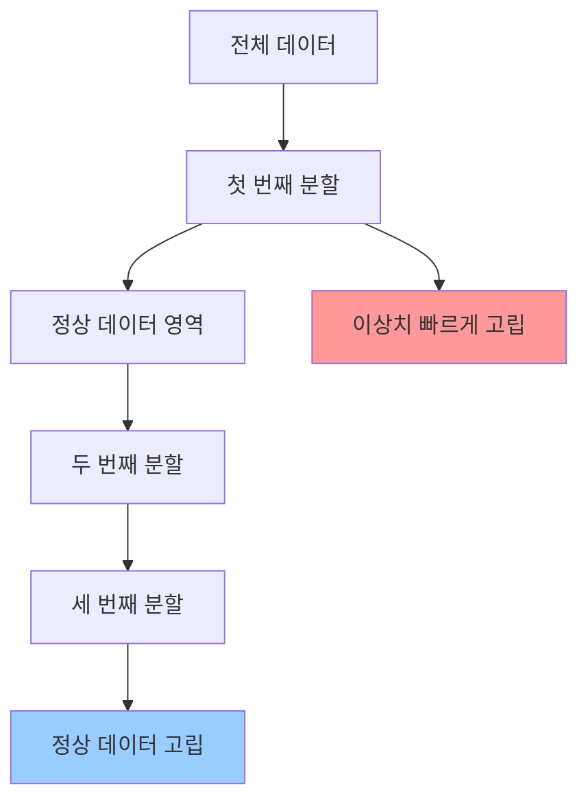
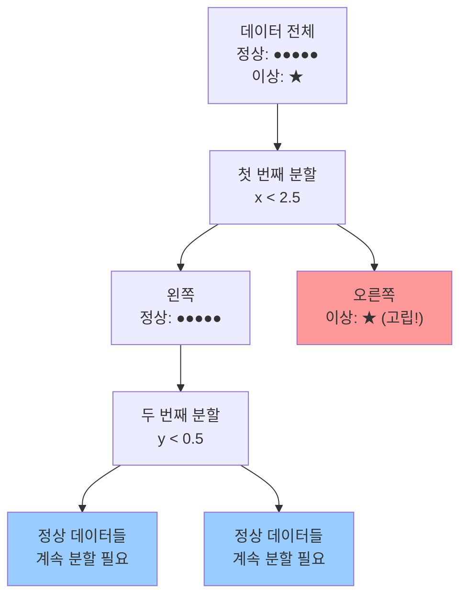

# Isolation Forest란?

**Isolation Forest**는 2008년 Liu, Ting, Zhou에 의해 발표된 혁신적인 이상탐지(Anomaly Detection) 알고리즘입니다. 기존의 거리 기반이나 밀도 기반 방법들과는 달리, 이상치를 **고립(Isolation)**시키는 방식으로 탐지하는 독창적인 접근법을 제시합니다.

여러개의 의사결정나무(Decision Tree)를 종합한 앙상블 기반의 이상탐지 기법으로, 의사결정 나무를 지속적으로 분기시키면서 모든 데이터 관측치의 고립 정도 여부에 따라 이상치를 판별하는 방법입니다.

## 핵심 아이디어와 직관

### 이상치의 두 가지 특성

Isolation Forest는 이상치(Anomalies)가 갖는 두 가지 양적 특성을 활용합니다:

1. **희소성(Few)**: 이상치는 정상 데이터에 비해 개수가 적습니다
2. **차별성(Different)**: 이상치는 정상 데이터와 속성값이 매우 다릅니다

### 고립의 개념

**고립(Isolation)**이란 한 인스턴스를 나머지 모든 인스턴스들로부터 분리하는 것을 의미합니다. 이상치는 위의 두 특성으로 인해 정상 데이터보다 훨씬 쉽게 고립됩니다.



## 알고리즘 원리

### 1. Isolation Tree (iTree) 구축

각각의 Isolation Tree는 다음과 같은 방식으로 구축됩니다:

1. **랜덤 속성 선택**: 모든 속성 중에서 하나를 무작위로 선택
2. **랜덤 분할값 선택**: 선택된 속성의 최소값과 최대값 사이에서 무작위로 분할값 선택
3. **재귀적 분할**: 다음 조건 중 하나가 만족될 때까지 재귀적으로 분할 진행
   - 노드에 하나의 인스턴스만 남을 때
   - 트리가 최대 깊이에 도달할 때
   - 모든 인스턴스가 같은 값을 가질 때

### 2. Path Length 계산

각 데이터 포인트 x에 대해 루트 노드부터 외부 노드(리프 노드)까지의 경로 길이 h(x)를 계산합니다.

$$h(x) = \text{루트 노드부터 x가 고립되는 노드까지의 edge 수}$$

### 3. Anomaly Score 계산

이상 점수는 다음 공식으로 계산됩니다:

$$s(x,n) = 2^{-\frac{E(h(x))}{c(n)}}$$

여기서:
- **E(h(x))**: 모든 iTree에서 x의 평균 경로 길이
- **c(n)**: 정규화 상수 (이진 탐색 트리에서 실패한 탐색의 평균 경로 길이)

$$c(n) = 2H(n-1) - \frac{2(n-1)}{n}$$

$$H(i) = \ln(i) + 0.5772156649 \text{ (오일러 상수)}$$

### 이상 점수 해석

- **s → 1**: 이상치일 가능성이 높음 (E(h(x)) → 0)
- **s → 0.5**: 정상 데이터일 가능성이 높음 (E(h(x)) → c(n))
- **s → 0**: 명확한 정상 데이터 (E(h(x)) → n-1)

## 알고리즘 구현

### Training Stage

```python
# Algorithm 1: iForest 구축
def iForest(X, t, ψ):
    """
    X: 입력 데이터
    t: 트리 개수
    ψ: 서브샘플링 크기
    """
    Forest = []
    for i in range(t):
        X_sample = sample(X, ψ)  # 서브샘플링
        Tree = iTree(X_sample, 0, height_limit)
        Forest.append(Tree)
    return Forest

def iTree(X, e, l):
    """
    X: 현재 데이터
    e: 현재 높이
    l: 높이 제한
    """
    if e >= l or len(X) <= 1:
        return ExNode(X)
    
    # 랜덤 속성과 분할값 선택
    q = random_attribute(X)
    p = random_split_point(X, q)
    
    # 데이터 분할
    X_l = {x ∈ X | x[q] < p}
    X_r = {x ∈ X | x[q] ≥ p}
    
    return InNode(
        left=iTree(X_l, e+1, l),
        right=iTree(X_r, e+1, l),
        split_attr=q,
        split_val=p
    )
```

### Evaluation Stage

```python
# Algorithm 3: Path Length 계산
def PathLength(x, T, e):
    """
    x: 테스트 인스턴스
    T: iTree
    e: 현재 경로 길이
    """
    if T is ExternalNode:
        return e + c(T.size)
    
    a = T.splitAtt
    if x[a] < T.splitValue:
        return PathLength(x, T.left, e+1)
    else:
        return PathLength(x, T.right, e+1)
```

## 실제 예제로 이해하기

### 2차원 데이터 예제

정상 데이터가 원점 주변에 클러스터를 이루고, 이상치가 멀리 떨어져 있는 경우:

```python
import numpy as np
import matplotlib.pyplot as plt
from sklearn.ensemble import IsolationForest

# 데이터 생성
np.random.seed(42)
normal_data = np.random.normal(0, 1, (100, 2))
anomaly_data = np.array([[3, 3], [-3, -3], [3, -3]])
X = np.vstack([normal_data, anomaly_data])

# Isolation Forest 모델 훈련
clf = IsolationForest(contamination=0.1, random_state=42)
y_pred = clf.fit_predict(X)

# 시각화
plt.figure(figsize=(10, 8))
plt.scatter(X[y_pred == 1, 0], X[y_pred == 1, 1], 
           c='blue', label='정상', alpha=0.6)
plt.scatter(X[y_pred == -1, 0], X[y_pred == -1, 1], 
           c='red', label='이상치', alpha=0.8)
plt.legend()
plt.title('Isolation Forest 이상치 탐지 결과')
plt.show()
```

### 분할 과정 시각화

이상치가 정상 데이터보다 적은 분할로 고립되는 과정:



## 하이퍼파라미터 튜닝

### 주요 파라미터들

1. **n_estimators (트리 개수)**
   - 기본값: 100
   - 일반적으로 100개 이전에 경로 길이가 수렴
   - 너무 많으면 계산 비용 증가

2. **max_samples (서브샘플링 크기)**
   - 기본값: min(256, n_samples)
   - 논문 권장값: 256
   - 너무 크면 swamping/masking 효과 발생

3. **contamination (오염도)**
   - 데이터셋에서 이상치 비율
   - 범위: (0, 0.5]
   - "auto"로 설정하면 0.1 사용

4. **max_features**
   - 각 트리에서 사용할 특성 개수
   - 기본값: 1.0 (모든 특성 사용)

### 파라미터 선택 가이드라인

```python
# 데이터 크기별 권장 설정
if n_samples < 1000:
    max_samples = n_samples
elif n_samples < 10000:
    max_samples = 512
else:
    max_samples = 1024

# 고차원 데이터의 경우
if n_features > 10:
    max_features = min(n_features, 10)
```

## 장점과 한계

### 장점

1. **계산 효율성**
   - 선형 시간 복잡도: O(tψ log ψ)
   - 대용량 데이터에 적합
   - 거리 계산 불필요

2. **확장성**
   - 고차원 데이터에서도 효과적
   - 메모리 효율적
   - 병렬 처리 가능

3. **모델 특성**
   - 비지도 학습
   - 데이터 분포에 대한 가정 없음
   - 해석 가능한 결과

4. **Swamping과 Masking 방지**
   - 서브샘플링으로 문제 완화
   - 각 트리가 다른 패턴 학습

### 한계점

1. **고차원 데이터에서의 문제**
   - 축 평행 분할(axis-parallel splits)로 인한 편향
   - 차원의 저주 영향

2. **데이터 특성 의존성**
   - 정상 데이터가 조밀한 클러스터를 형성할 때 효과적
   - 균등 분포 데이터에서는 성능 저하

3. **파라미터 민감성**
   - contamination 파라미터 설정의 어려움
   - 도메인 지식 필요

## 실무 적용 사례

### 1. 네트워크 보안

```python
# 네트워크 트래픽 이상 탐지
from sklearn.ensemble import IsolationForest
import pandas as pd

# 네트워크 특성 데이터 로드
network_data = pd.read_csv('network_traffic.csv')
features = ['packet_size', 'duration', 'protocol_type', 
           'src_bytes', 'dst_bytes']

# 모델 훈련
clf = IsolationForest(
    n_estimators=200,
    max_samples=256,
    contamination=0.05,
    random_state=42
)

# 이상 트래픽 탐지
anomaly_scores = clf.decision_function(network_data[features])
predictions = clf.predict(network_data[features])

# 결과 분석
suspicious_traffic = network_data[predictions == -1]
print(f"탐지된 의심 트래픽: {len(suspicious_traffic)}건")
```

### 2. 금융 사기 탐지

```python
# 신용카드 거래 이상 탐지
financial_features = ['amount', 'time', 'merchant_category',
                     'transaction_frequency', 'location_risk']

# 시간 기반 특성 엔지니어링
def create_time_features(df):
    df['hour'] = pd.to_datetime(df['timestamp']).dt.hour
    df['day_of_week'] = pd.to_datetime(df['timestamp']).dt.dayofweek
    df['amount_log'] = np.log1p(df['amount'])
    return df

# 이상 거래 탐지
fraud_detector = IsolationForest(
    contamination=0.02,  # 사기율 2%
    max_samples=512,
    random_state=42
)

fraud_predictions = fraud_detector.fit_predict(transaction_data)
```

### 3. 제조업 품질 관리

```python
# 센서 데이터 기반 불량품 탐지
sensor_features = ['temperature', 'pressure', 'vibration',
                  'humidity', 'rotation_speed']

quality_detector = IsolationForest(
    n_estimators=150,
    max_samples=256,
    contamination=0.03,
    max_features=0.8  # 80% 특성만 사용
)

# 실시간 모니터링
def real_time_monitoring(sensor_reading):
    score = quality_detector.decision_function([sensor_reading])[0]
    prediction = quality_detector.predict([sensor_reading])[0]
    
    if prediction == -1:
        return "품질 이상 감지!", score
    else:
        return "정상", score
```

## 성능 평가 및 개선

### 평가 지표

```python
from sklearn.metrics import classification_report, roc_auc_score, roc_curve
import matplotlib.pyplot as plt

# ROC 곡선 그리기
def plot_roc_curve(y_true, y_scores):
    fpr, tpr, thresholds = roc_curve(y_true, y_scores)
    auc = roc_auc_score(y_true, y_scores)
    
    plt.figure(figsize=(8, 6))
    plt.plot(fpr, tpr, linewidth=2, label=f'ROC Curve (AUC = {auc:.3f})')
    plt.plot([0, 1], [0, 1], 'k--', linewidth=1)
    plt.xlabel('False Positive Rate')
    plt.ylabel('True Positive Rate')
    plt.title('Isolation Forest ROC Curve')
    plt.legend()
    plt.grid(True)
    plt.show()

# 성능 평가
def evaluate_isolation_forest(clf, X_test, y_true):
    # 예측 및 점수
    y_pred = clf.predict(X_test)
    scores = clf.decision_function(X_test)
    
    # 이진 분류로 변환 (1: 정상, -1: 이상)
    y_pred_binary = (y_pred == -1).astype(int)
    
    # 평가 지표 계산
    auc = roc_auc_score(y_true, -scores)  # 점수가 낮을수록 이상치
    
    print("분류 성능 보고서:")
    print(classification_report(y_true, y_pred_binary))
    print(f"AUC Score: {auc:.3f}")
    
    return auc, scores
```

### 하이퍼파라미터 최적화

```python
from sklearn.model_selection import GridSearchCV
from sklearn.metrics import make_scorer

# 사용자 정의 평가 함수
def anomaly_score(y_true, y_pred):
    # y_pred는 decision_function의 출력
    return roc_auc_score(y_true, -y_pred)

# 그리드 서치 수행
param_grid = {
    'n_estimators': [50, 100, 200],
    'max_samples': [128, 256, 512],
    'contamination': [0.05, 0.1, 0.15],
    'max_features': [0.5, 0.8, 1.0]
}

# 주의: Isolation Forest는 비지도 학습이므로 
# 실제로는 validation set으로 평가해야 함
best_params = {
    'n_estimators': 100,
    'max_samples': 256,
    'contamination': 0.1,
    'max_features': 1.0
}
```

## Extended Isolation Forest

### 기존 방법의 한계

Isolation Forest의 축 평행 분할(axis-parallel splits)로 인한 문제점:
- 대각선 패턴을 갖는 이상치 탐지 어려움
- 고차원에서 편향된 결과

### 개선 방법

Extended Isolation Forest는 경사 분할(slope-based splits)을 도입:

$$\vec{n} \cdot (\vec{x} - \vec{p}) \leq 0$$

여기서:
- $\vec{n}$: 정규분포에서 샘플링한 방향 벡터
- $\vec{p}$: 분할점

## 결론 및 향후 연구 방향

Isolation Forest는 이상탐지 분야에서 패러다임을 바꾼 중요한 알고리즘입니다. 고립이라는 직관적인 개념을 통해 효율적이고 확장 가능한 이상탐지 방법을 제시했습니다.

### 주요 기여점

1. **새로운 관점 제시**: 거리/밀도 대신 고립 개념 도입
2. **계산 효율성**: 선형 시간 복잡도로 대용량 데이터 처리
3. **실용성**: 다양한 도메인에서 성공적 적용

### 활용 권장 상황

- **대용량 고차원 데이터**
- **실시간 이상탐지 시스템**
- **도메인 지식이 제한적인 상황**
- **빠른 프로토타이핑이 필요한 경우**

### 향후 연구 방향

1. **Deep Isolation Forest**: 딥러닝과의 결합
2. **Online Isolation Forest**: 스트리밍 데이터 처리
3. **Federated Isolation Forest**: 분산 환경에서의 이상탐지
4. **Explainable Isolation Forest**: 해석 가능한 이상탐지

Isolation Forest는 단순함 속에 깊은 통찰을 담고 있는 알고리즘으로, 이상탐지 분야의 필수 도구로 자리잡았습니다. 적절한 파라미터 튜닝과 도메인 특성을 고려한다면 매우 강력한 이상탐지 성능을 발휘할 수 있습니다.

## 참고 문헌

1. Liu, F. T., Ting, K. M., & Zhou, Z. H. (2008). Isolation forest. In 2008 eighth ieee international conference on data mining (pp. 413-422). IEEE.
2. Liu, F. T., Ting, K. M., & Zhou, Z. H. (2012). Isolation-based anomaly detection. ACM Transactions on Knowledge Discovery from Data, 6(1), 1-39.
3. Hariri, S., Kind, M. C., & Brunner, R. J. (2019). Extended isolation forest. IEEE Transactions on Knowledge and Data Engineering, 33(4), 1479-1489.
4. Scikit-learn Documentation: Isolation Forest
5. Chandola, V., Banerjee, A., & Kumar, V. (2009). Anomaly detection: A survey. ACM computing surveys, 41(3), 1-58.

---

**관련 포스트**
- LOF (Local Outlier Factor) 알고리즘 완전 정복
- One-Class SVM을 활용한 이상탐지  
- 시계열 데이터 이상탐지 기법 비교
- AutoEncoder 기반 이상탐지 구현

